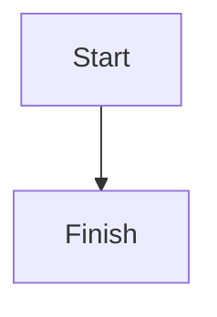

# Markdown extensions

Skelp supports standard Markdown plus rich media, Mermaid diagrams, and KaTeX math.

## Media

Use a custom block with the URL on its own line. Options such as `title`, `caption`, `alt`, and `poster` are optional.

```markdown
:::image alt="Landscape" caption="A nice view"
https://upload.wikimedia.org/wikipedia/commons/3/3f/Fronalpstock_big.jpg
:::

:::audio title="Recording"
https://upload.wikimedia.org/wikipedia/commons/c/c8/Example.ogg
:::

:::video poster="https://upload.wikimedia.org/wikipedia/commons/3/3f/Fronalpstock_big.jpg"
https://upload.wikimedia.org/wikipedia/commons/transcoded/8/88/Big_Buck_Bunny_alt.webm/Big_Buck_Bunny_alt.webm.480p.vp9.webm
:::

:::iframe title="Micro app"
/built-in/files/
:::
```

Regular Markdown images (``) are also styled as rich media.

## Mermaid

Use a fenced code block with the `mermaid` language:

````markdown

````

## KaTeX

Use `$...$` for inline math and `$$...$$` for display math:

```markdown
Einstein's equation is $E = mc^2$.

$$
\int_0^\infty e^{-x}\,dx = 1
$$
```
